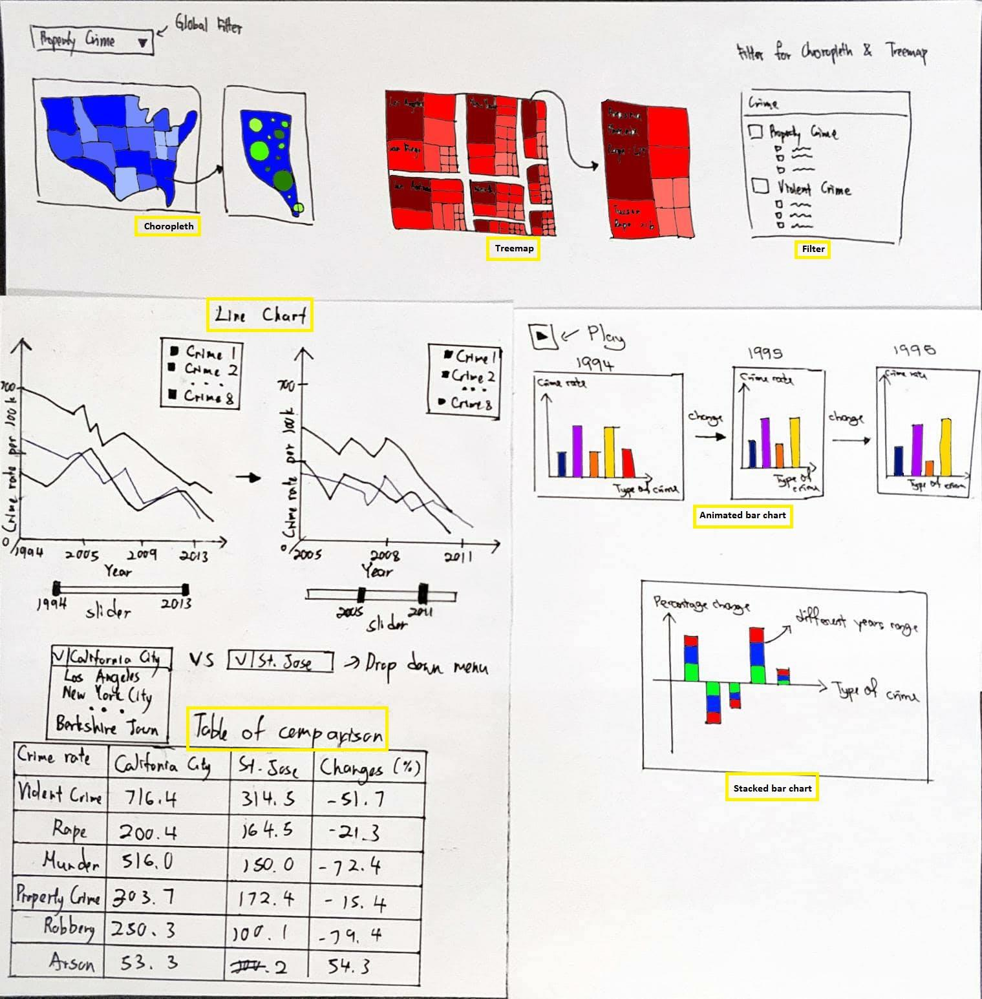

# TDS 3401 Data Visualization

# Project: Creating Interactive Visualizations

Team Members:

NG CHIN ANN 1142701684

LEE BOON PING 1142701239

WONG ZI XIANG 1142701102

Date: 19th January 2018

**American Crime Story**

The dataset to be worked on this project is FBI Crime Data which is adapted from Uniform Crime Reporting (UCR) website by Federal Bureau of Investigation (FBI) in United States.

There are two downloadable dataset hosted on the website:

-   Crime in the United States from 1994 - 2013

-   Crime in the United States in 2013

In which the first dataset is listed by states and then by cities in U.S. while the second one are listed by Volume and Rate per 100, 000 Inhabitants in 20 years.

**Description of Data Domain**

The data that will be worked on this project is crime. The data collected are based on different types of crimes with their corresponding count in United States. There are time series data which is the crime recorded for 20 years and also the location data which represented different kinds of crimes by cities and by states in United States. Generally, crime can be defined as the act of a person which is not allowed under law and it’s punishable. Typically, the crime in U.S are classified into two categories which are violent crime and property crime. The example of violent crimes which commonly committed by the public are rape, robbery and aggravated assault while the example of property crime can be burglary and motor vehicle theft. It is quite obvious that crime is increasing day by day. However, in the generation of Big Data, millions of criminal cases can be fully analysed in order to derive significant insights toward reducing the number of criminal cases globally.

**Description of Dataset**

There are two dataset found on the UCR website. Both of them are recorded through UCR Program. Both dataset recorded different type of crime behavior in different timestamp. The first dataset is named Crime in United States from 1994 - 2013 and the second dataset is named Crime in United States in 2013.

There are two tables in the first dataset. The first table is describing the crime in U.S by volume and rate per 100, 000 inhabitants in 20 years. The data is grouped by year with each year contain the volume of different crime separated by columns. Hence there is 20 rows with each row representing a year. The last row of the table, which contain data recorded in year 2013 is further described in the second dataset in more detail. The second table is describing about the percent change in volume and rate per 100, 000 inhabitants of crime in U.S. for 2 years, 5 years and 10 years. Below are the attributes for both datasets:

-   State

-   City

-   Population

-   Violent Crime

-   Murder and nonnegligent manslaughter

-   Rape

-   Robbery

-   Aggravated assault

-   Property crime

-   Burglary

-   Larceny-theft

-   Motor vehicle theft

-   Arson3

The second dataset contains different type of crimes reported in year 2013 grouped by name of city and by name of states in U.S. There are total of 9k+ rows in the dataset with each rows representing the crime reported in a city. The violent crime recorded in the dataset are murder, rape and robbery. The property crime recorded are burglary, larceny-theft and motor vehicle theft. Below are the attributes contain in the dataset:

|                                               |
|-----------------------------------------------|
| Table 1/Table 1A                              |
| -   Year                                      
                                                
 -   Population                                 
                                                
 -   Violent crime                              
                                                
 -   Murder and nonnegligent manslaughter       
                                                
 -   Murder and nonnegligent manslaughter rate  
                                                
 -   Rape                                       
                                                
 -   Rape rate                                  
                                                
 -   Robbery                                    
                                                
 -   Robbery rate                               
                                                
 -   Aggravated assault                         
                                                
 -   Aggravated assault rate                    
                                                
 -   Property crime                             
                                                
 -   Property crime rate                        
                                                
 -   Burglary                                   
                                                
 -   Burglary rate                              
                                                
 -   Larceny-theft                              
                                                
 -   Larceny-theft rate                         
                                                
 -   Motor vehicle theft                        
                                                
 -   Motor vehicle theft rate                   |

**Possible visualization and why**

**Choropleths** can be used in the second dataset to visualize different type of crimes committed by the public of U.S since the data are group by states and cities. With the help of color gradient, the number of crimes in different states can be clearly visualized to identify the regions that are critical with a particular crime. Furthermore using city name recorded in the dataset, the choropleth can be further zoomed in to a state of interest to see the condition of crimes happened in different cities in the particular state. With the help of shape with different sizes, the overall severity of crimes reported in different cities can be identified. In terms of interaction with users, the data can be filter by different category of crimes available in the dataset, for example, he/she can choose to view violent crime or property crime or even drill down into different types of crime in either one category. Users are also able to zoomed into one of the states and drag the choropleth around to have a closer look on the condition of crimes in the cities of the selected state.

**Treemap** are useful when there is hierarchical data. In the dataset, the crime data is grouped by stats and then by city. Hence, the data has two levels of detail. With the help of treemap, the ranking of crime in cities grouped by state can be revealed. Moreover, color and size added to the treemap can clearly distinguish different states and the count of crime in different cities. Since there are too many cities in a state, using treemap can quickly sort out the top number of cities with selected crime in different states in one view. For interaction between users, a filter can be placed to allow users to see different crimes in a selective way.

**Line charts,** or line graphs, are powerful visual tools that illustrate trends in data over a period of time. In the first dataset, it comprises time series data of crime rate and volume over a period of 20 years. With the help of color and shape of lines, user can easily distinguish the different attributes plotted on the graph. Audience will quickly recognize which type of crime are declining or increasing throughout the years. Users can interact with the line graphs by setting the year range through a slider, and hovering on the line to show the drop or increase between the year range chosen for that specific crime type in term of percentage.

**Table of comparison** is a classic and efficient way to compare details between two entities. In the second dataset, it comprises crime rate and volume of thousands of cities of united states. With the attributes on the same row, audience can spot the differences between two cities easily. Users can interact with the table by having two drop down menus to choose cities from. Then the crime types of two chosen cities will be displayed and compared.

**Animated bar chart** is a interesting way to display time series data. In first dataset, we have time series data of 20 years period for crimes. Users can “play” the bar chart where it will display 20 years of data in a video-like motion. Users can also “stop” the bar chart at specific year.

**Bar chart** is a suitable method to show the changes of all crime between certain years. In the first dataset, it contains the percentage change of crime and the duration of years. With the variables, bar chart able to illustrate the certain years against the difference of crime clearly.

**Storyboard**

Sample Storyboard

There will be two sections for the storyboard, one for the first dataset and one for the second dataset. For the second dataset, a global filter will be setup in order to allow filtering on different kinds of crime. Apart from the global filter, a local filter will also be placed for each visualization.

For **choropleth**, a user can select the state of interest to zoom in and drag around it. Furthermore, users are able to select multiple crimes to display in a state, whereby the type of crimes will be represented in different colors and sizes and only the crime with highest count will be shown for each city in the state.

For **treemap**, users can choose to filter based on different types of crimes. Users are able to hover to see the text likes name of city and number of crimes if the size of block in the treemap is small due to lower counts. Next, users can also click on a state to zoom into the treemap so that the treemap displays only the selected stated. Furthermore, users can select to view by cities, meaning the treemap will be group by cities instead of by states and by cities. By doing this, the cities are displayed and sorted by number of crime selected in descending order.

For **multi-series line chart**, it first renders all 7 types of crime in a period of 20 years (1994-2013) by default. Users can specify the year range they want to render through a slider. Users can also hover on the lines (crime types) to show the difference (%) of crime rate between two years specified by the slider.

For **table of comparison**, we will set the default two comparison to any cities. Users can choose two cities to compare via two drop down menu. The table will then shows all crime types for both cities as well as their difference in percentage.

For **paged bar chart**, it first renders the oldest of the 20 years worth of dataset. When users press “play”, it will then replace the chart with next year’s dataset and so on until the final year. Users can also press “stop” button to stop the bar chart at specific year.

For **stacked bar chart**, it first readers the percentage change of crime in a certain period of 2 years, 5 years and 10 years. It will show the percentage change of crime in 2 years stacked by

5 years and 10 years.

**Changes made in Final Implementation**

In overall, there was no changes made to the storyboard in the final implementation except for the **table of comparison** and **animated bar chart**. The table of comparison was changed to **grouped bar chart**. The grouped bar chart visualize all type of crimes and compare the volume for each crime types between two selected states using dropdown menu.

Changes made to **animated bar chart** was added tooltips showing volume of crime types on mouse hover. Also, year slider was added to it so user can choose to visualize data of specific year. Label about volume of crime committed was also added to each respective bar.

**Development Process**

Each team members was assigned two graphs to create:

1.  Ng Chin Ann — choropleth & treemap

2.  Wong Zi Xiang — multi-series line chart & grouped bar chart

3.  Lee Boon Ping — animate bar chart & stacked bar chart

Hour spent developing:

1.  Choropleth — 6 hours

2.  Treemap — 20 hours

3.  Multi-series line chart — 20 hours

4.  Grouped bar chart — 15 hours

5.  Animated bar chart — 30 hours

6.  Stacked bar chart — 10 hours

**Commentary**

During the development of **multi-series line chart**, we faced a problem where the changes of the line paths’ data are not propagated to its mouse events. After almost half a day of researching, we found that a click handler on any element receives the current data bound to that element. So, if the data bound to the element changes, the listener receives whatever the latest data is. However, updating data on parent elements does not automatically propagate data to descendent elements. We need to update it by manually selecting the path again and specify the mouse hover events.

Other than that, create an **animated bar chart** is not an easy task. In the beginning, we thought the play button is enough for animating the bar chart. Then only realised that play button must come with the slider so that user can go to the specific year to view the result they wanted. Other than that, we harder to get the right information when we only can approximate the value using our eye if the bar does not have label. So we decided to add the label for the better understanding.

**Most time consuming aspects**

One of the most consuming aspects we have done is the animation of bar chart. We have searched a lot of different method to program the play button. Then we found another great method to solve the problem which is program the play button with the slider. We have spent at least one day to program the animation of the bar chart.

Other than that, we faced the issues while creating the dashboard because we are not familiar with functional programming style. We also new to D3.js, so there is a lot of syntax that we do not understand. We have invested a lot of time in researching about D3.js to get a better understanding.
